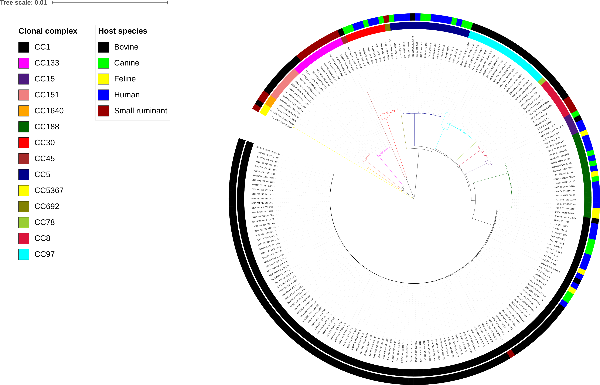

The NJ tree constructed using the core genome alignment with the pairwise hamming distance matrix calculated by Jukes-Cantor method of the 212 S. aureus isolates from bovine, humans, dogs, cat and small-ruminants.
  

